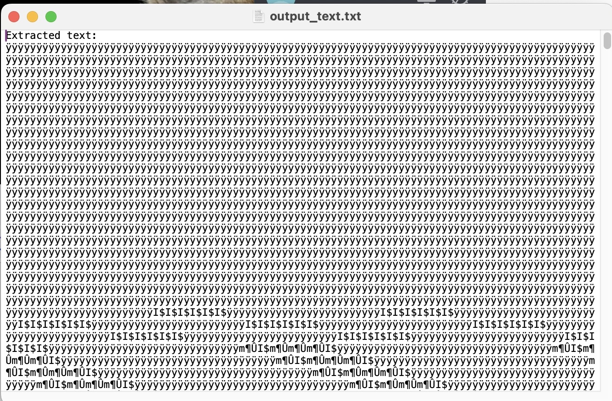
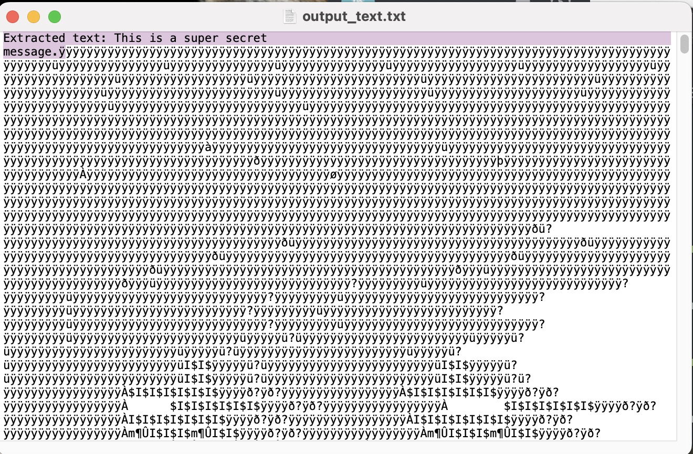

# Steganography using Python vs Steghide via CLI

## What is Steganography and how does it compare to Cryptography?

Steganography is a method in which secret messages are hidden in cover media. Cover media refers to any unsuspicious file, such as a nature photo, family photo, audio, video clip, etc. And steganography means "covered writing".

>Content concealed through steganography is sometimes encrypted before being hidden within another file format. If it isn't encrypted, then it may be processed in some way to make it harder to detect. ⏤ <cite>[*What is steganography? Definition and explanation*](https://www.kaspersky.com/resource-center/definitions/what-is-steganography)</cite>

Steganography is sometimes compared to cryptography, because both are a form of covert communication. However, the two are NOT the same. Steganography does not involve scrambling data upon sending or using a key to decode it upon receipt. As a result, steganography is less popular than cryptography, because the structure of data is not altered by default. Forms of steganography are:

- Text
- Audio
- Video
- Images
- Network or Protocol

## What is Cryptography and how does it compare to Steganography?

Cryptography is the process of hiding or coding information so that only the person the message was intended for can read it. Modern cryptography techniques include algorithms and ciphers that enable the encryption and decryption of information, such as 128-bit and 256-bit encryption keys. Modern ciphers, such as the Advanced Encryption Standard (AES), are considered virtually unbreakable. To learn more about encrypting and decrypting files, please visit my post entitled [Encrypting/Decrypting Files and Strings](https://github.com/interglobalmedia/encrypt-decrypt-files-python) on Github.

According to [Fortnet](https://www.fortinet.com/resources/cyberglossary/what-is-cryptography),

>Cryptography remains important to protecting data and users, ensuring confidentiality, and preventing cyber criminals from intercepting sensitive corporate information.

## So what is Image Stenography in Cryptography?

According to [Geeks For Geeks](https://www.geeksforgeeks.org/image-steganography-in-cryptography/),

>As the name suggests, Image Steganography refers to the process of hiding data within an image file. The image selected for this purpose is called the cover image and the image obtained after steganography is called the stego image.

Steganography in of itself is "security by obscurity". This means that the secret message embedded in the image could end up being "uncovered". But combining and cryptography Steganography is a robust way to disguise a message from adversaries while still protecting it in case of detection.

One way of implementing a cryptographic algorithm approach is concealing a [large amount of data](https://www.geeksforgeeks.org/image-steganography-in-cryptography/) within a color bitmap (bmp) image. The image is filtered and segmented, with bits replacement applied to the appropriate pixels. These pixels are chosen at random.

Detection of the message within the cover image is done by the process of steganalysis. And what is steganalysis? According to Mayuri Bhamare in his Linkedin post entitled [What is Steganalysis?](https://www.linkedin.com/pulse/what-steganalysis-mayuri-bhamare/),

>Steganalysis is the study of detecting messages hidden using steganography; this is analogous to cryptanalysis applied to cryptography. Steganalysis refers to detection of the presence of hidden information in the stego-object.

I actually built an image steganography project implementing the above described bitmap approach using the the PIL (Python Imaging Library). When I decrpyted the encrypted hidden text message inside an image, I got totally incomprehensible data output in Terminal. I also could not view the complete output, because it was too large for viewing in aTerminal window instance. O I created a CLI command that would redirect the data into a text file that I could open and examine after running the command. The following is the command that I cerated to do this:

```shell
python3 cryptography-stenography.py >> output_text.txt
```

This way, I could examine the complete output resulting from the executing of my `cryptography-stenography.py` file. Totally impossible to decipher. However, I found that using a jpg image is not good, because it is a lossy file format, which means that information is lost in processes.

Screenshot of executing `python 3 cryptography-stenography.py >> output_text.txt` before changing my jpg file to a png file:



To change the file format of an image on macOS via the CLI, I ran the following command:

```shell
sips -s format png geranimo-bKhETeDV1WM-unsplash.jpg --output geranimo-bKhETeDV1WM-unsplash.png
```

For those of you that may not know what the sips command, it comes built in with macOS. `sips` stands for `Scriptable image processing system`, and it is:

>used to query or modify raster image files (JPG/GIF/PNG) and ColorSync ICC profiles. Image processing options include flip, rotate, change image format/width/height. Its functionality can also be used through the "Image Events" AppleScript suite.

When I changed it to png format, and then ran the following command again:

```shell
python3 cryptography-stenography.py >> output_text.txt
```

The hidden text does appear the top of the txt file, followed by the bitmap information of the image.



To view this project, please visit the [image-steganography-project](https://github.com/interglobalmedia/image-steganography-project) repository on Github.

## Applying image steganography with the steghide via Kali Linux

In order to use the steghide package which is a command line tool, I have to install and use it via Kali Linux. I am on macOS and therefore not a Linux computer, so installing `steghide` directly onto my macOS is not possible.

## Related Resources

- [What is steganography? Definition and explanation](https://www.kaspersky.com/resource-center/definitions/what-is-steganography)

- [Difference between Steganography and Cryptography](https://www.geeksforgeeks.org/difference-between-steganography-and-cryptography/)

- [What is Cryptography?](https://www.fortinet.com/resources/cyberglossary/what-is-cryptography)

- [Image Steganography in Cryptography](https://www.geeksforgeeks.org/image-steganography-in-cryptography/)

- [What is Steganalysis?](https://www.linkedin.com/pulse/what-steganalysis-mayuri-bhamare/)

- [sips macOS utility](https://ss64.com/osx/sips.html)